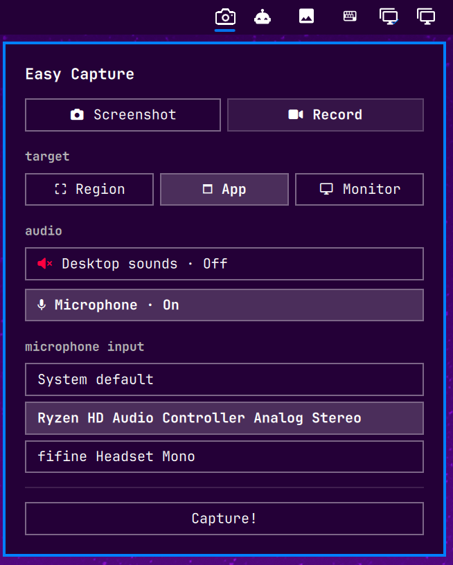

# Easy Capture

Capture your screen in a few clicks, without memorizing hotkeys. Screenshot or record regions, apps, or monitors straight from your Omarchy bar, with optional desktop sound, microphone selection, and app capture across screens.



Captures stay on your computer. Audio is off until you enable it.

## New in 0.4.0

- One shared capture service: start on one monitor, see the timer and stop on either.
- Owned process cleanup, bounded device discovery, and clear capture errors.
- Private capture files that never overwrite an existing file.
- The same compact tabs, microphone picker, muted icons, and steady hover colors.
- Scrollable controls for longer device lists, with keyboard navigation.

## Install

```sh
omarchy plugin add https://github.com/chyld/omarchy-easy-capture.git --enable
```

Uses Omarchy/Quickshell, Hyprland, system Python 3, `slurp`, `hyprpicker`, `grim`,
`wl-copy`, `gpu-screen-recorder`, `pactl`, and `notify-send`. No Python packages
or separate setup scripts are required. Capture output requires a Linux filesystem
with anonymous-file support (`O_TMPFILE`), such as ext4 or Btrfs.

## Update

```sh
omarchy plugin update chyld.easy-capture
omarchy restart shell
```

Stop any active recording before updating or restarting. The restart loads the
new shared QML service and clears cached components.

## Remove

```sh
omarchy plugin remove chyld.easy-capture
```

Removing the last widget cancels its active picker or capture and stops owned
helper, recorder, freeze and clipboard processes. Finish a recording with the
Stop control first if you want to save it: cancelled captures are discarded.

Removal deletes `~/.config/omarchy/plugins/chyld.easy-capture/`. Completed captures
remain in their output directories. Installed capture tools remain installed.
Quickshell runtime logs under `$XDG_RUNTIME_DIR/quickshell/` and its managed cache
may remain. There are no plugin credentials, persistent settings, service units,
shared configuration edits, or privilege grants to remove. Clipboard managers
may independently retain copied images.

## What it shows

- A camera icon that opens the dialog.
- **Screenshot** and **Record** tabs with Region, App, and Monitor targets.
- A monitor list when you need to choose between displays.
- Desktop sound and microphone toggles under Record; muted icons are red.
- Named microphone inputs plus **System default** when multiple inputs are available.
- A pulsing red dot and timer on each bar while recording; click a camera icon to stop.

Choose your target and audio options, then click **Capture!** Changing a tab or
target alone does not start a capture. Region and App open the picker after the
dialog fades out. Click an app or drag a region; Escape cancels. The picker does
not use Omarchy's shared marker files or its global picker-specific shortcuts.

Tab/Shift+Tab move through dialog controls. Arrows or h/j/k/l navigate within and
between sections. Enter or Space activates the highlighted control; Escape closes
the dialog. Long device lists scroll to keep the keyboard selection visible.

## When it refreshes

Device discovery starts when a dialog opens, not when the plugin loads. Microphone
inputs refresh when Record or Microphone is enabled and every three seconds while
the Record dialog is open with Microphone on. Failed refreshes back off and stop
after four consecutive failures; reopen the dialog to retry.

Speaker-monitor sources are excluded from the microphone picker. With one input,
its name appears without a picker. If the chosen input disappears during refresh,
selection returns to System default with a notice. The backend checks a named
input again before recording and refuses an unavailable device.

Tab, target, audio options, and recording state are shared across monitors and
kept in memory. Choices reset when the shell restarts. Each capture takes a fixed
snapshot of your choices; later UI changes do not alter a recording in progress.

## Capturing and recording

App selection includes visible windows on every enabled monitor, including open
special workspaces and pinned windows. Hidden workspaces, hidden windows, and
unmapped windows are excluded. A single monitor is selected automatically for the
Monitor target.

Desktop sound uses the system's default output. Microphone recording uses the
default input or your chosen device. Enabling both mixes them into one AAC track.
Recording uses 60 FPS with Omarchy's default encoding options; monitors larger
than 3840×2160 are capped. There is no webcam, output-device selector, or quality setting.

Stop signals only the recorder owned by this plugin and allows up to ten seconds
to finalize. Recordings stop at eight hours or the 16 GiB size threshold. A kernel
file-size ceiling allows at most 16 MiB of finalization overhead. Failed or
cancelled captures are not published as completed files.

## Data, network, and execution

Screenshots go to `~/Pictures` or `$OMARCHY_SCREENSHOT_DIR`; recordings go to
`~/Videos` or `$OMARCHY_SCREENRECORD_DIR`. XDG picture/video directory settings
are respected. `user-dirs.dirs` is read as bounded data; it is never executed.
Configured output paths must be absolute, without symlink components or unsafe
ownership/permissions. New directories are private; existing directory permissions
are not changed.

Files start as anonymous 0600 inodes and are published through the same descriptor
with a unique timestamped name. Existing files are never overwritten. Screenshots
are also offered to the clipboard. This clipboard provider ends when another
application replaces the clipboard, another capture begins, the plugin is removed,
the shell restarts, or eight hours elapse. Notifications identify saved filenames;
they contain no persisted executable actions or image paths.

The plugin has no upload, analytics, or network client. Device/window metadata comes
from local `hyprctl` and `pactl` commands. All tool paths are fixed under `/usr/bin`.
Python runs with `-I -S -B`; children receive only the required local desktop,
locale, home and output-directory settings, rather than the ambient environment.
Raw tool errors and capture contents are not sent to the shell log.

Metadata output is capped at 1 MiB per command before parsing; display lists are
limited to 16 entries, microphone inputs to 32, and window discovery to 512.
The shell receives only small validated JSON events. Capture geometry is bounded
to 64 megapixels, screenshots to 256 MiB, and the interactive picker to two minutes.
Children run in owned sessions with deadlines and cleanup on error, cancellation,
reload, or removal. Details and review limits are in [Security](docs/SECURITY.md).

## Development

```sh
node --test tests/model.test.js
/usr/bin/python3 -I -S -B -m unittest discover -s tests -p '*_test.py'
omarchy plugin validate .
# Requires a running Wayland session. Uses a fake capture backend.
/usr/bin/python3 -I -S -B tests/interface_test.py
```

Tests cover hostile output, file races, FIFO/symlink rejection, process-group cleanup,
audio arguments, cross-monitor selection, QML controls, shared state, and removal.
See [Architecture](docs/ARCHITECTURE.md) and [Contributing](docs/CONTRIBUTING.md).

## License

[MIT](LICENSE). The [Omarchy notice](LICENSE.omarchy) is retained for the workspace
and monitor-geometry behavior adapted from its capture helper.
