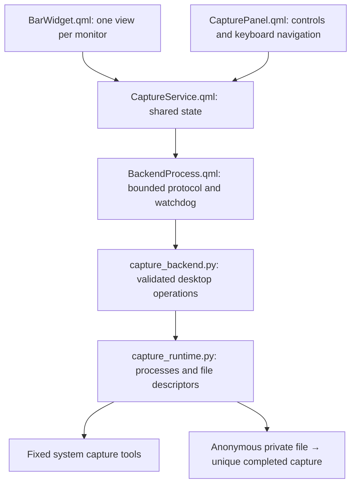

# Architecture

Easy Capture separates the display, state transitions, protocol, desktop operations,
and resource ownership. There is one service per QML engine, not one recorder per bar.

`CaptureModel.js` validates the small event schema before QML installs models or
changes state. `CaptureButton.qml` and `CaptureButtonGroup.qml` provide local,
non-animated controls. No UI component constructs a command or interprets a PID.

## Shared lifecycle

Widgets acquire a service subscription and release it on destruction. Opening a
popup registers visibility; only visible dialogs trigger device polling. Removing
one monitor's widget keeps another monitor's active recording intact. Removing the
last subscription cancels all owned work. Repeated refreshes are single-flight.

A capture follows `idle → preparing → picking → screenshotting` or
`idle → preparing → picking → starting → recording → stopping`. Monitor captures
skip picking. `preparing` immediately prevents a second start and stores an immutable
request. All open panels close, then a 200 ms delay keeps the popup out of the capture.
The helper returns completion, cancellation or a static error. The service preserves
the last saved filename and exposes errors for the next popup opening.

A screenshot helper can remain alive in its clipboard phase while the UI is idle.
A new capture cancels that provider and waits for its exit before launching. Transport
cancellation rejects late events; no new operation starts on a running transport.

## Process ownership

The backend is invoked as an isolated system Python process with a fixed operation.
Only captures receive a bounded JSON request over stdin. Stop is the literal `stop`
message on the same inherited pipe. No control socket, shared PID file, general-purpose
command runner, or public capture IPC endpoint exists.

Each tool starts in a new session. The runtime holds a pidfd and keeps its leader
unreaped until TERM/KILL cleanup is complete, preventing reuse of the process-group
identity even when the leader exits before descendants. Commands have absolute
deadlines; stdout is read incrementally and rejected on overflow. Tool stderr goes
to the null device. Capture writers also inherit a kernel file-size limit.

SIGTERM or stdin EOF cancels the backend. Its loaded cleanup code can finish even
after the plugin directory is removed. The QML watchdog has a longer escalation
window for an unresponsive helper. Uninterruptible kernel I/O remains an OS limitation.

## File ownership

Output paths are walked component by component through directory descriptors without
following symlinks. The final directory must belong to the user. Images and video are
written to an anonymous inode passed directly to the tool, never to a replaceable
filename. After successful completion, the backend fsyncs the inode, links that held
descriptor to a fresh filename without replacement, and fsyncs the directory.
Cancellation closes the unpublished inode; it does not delete an arbitrary path.

XDG configuration is descriptor-validated, capped, and parsed as passive directory
declarations. Notifications use sanitized filenames and no executable actions.

## Scope

The backend replaces the earlier embedded shell scripts and copied picker. The UI
retains the familiar capture workflow. The security boundary is the shared shell's
input and process/file handling; this is not an OS sandbox for the reviewed plugin
itself or a replacement for the capture tools' own security.
